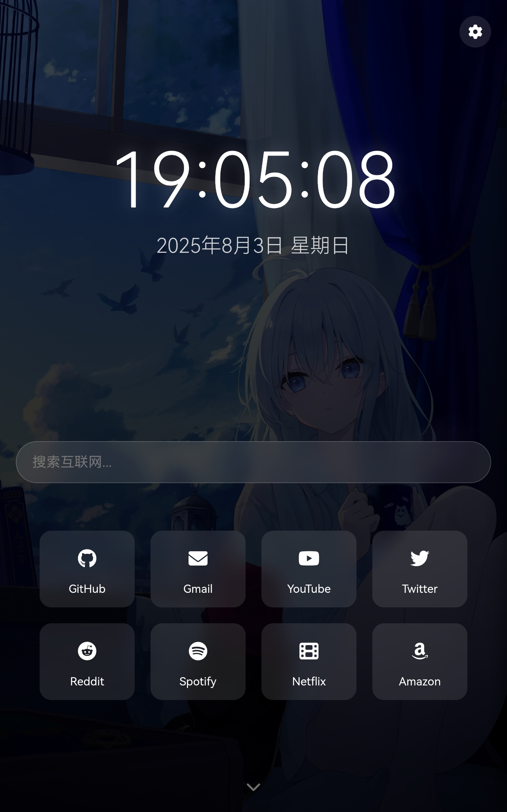

# DashSaver - 高级屏保仪表盘


[](https://opensource.org/licenses/MIT)
[](https://github.com/fastnow/DashSaver)

DashSaver 是一个现代化的网页屏保仪表盘，集成了时间日期显示、励志名言、搜索引擎和快捷链接等功能。它可以在空闲时作为屏保显示，也可以作为日常使用的浏览器主页。



## 功能特点

- **精美的时间日期显示** - 大字体显示当前时间，附带日期和星期信息
- **励志名言展示** - 自动切换励志名言或自定义文本
- **多引擎搜索** - 支持Google、Bing、DuckDuckGo、百度等搜索引擎
- **自定义快捷链接** - 添加常用网站快捷方式，支持Font Awesome图标
- **动态背景** - 自动切换高质量背景图片（来自Unsplash）
- **个性化设置** - 丰富的自定义选项（颜色、字体、动画效果等）
- **响应式设计** - 完美适配各种屏幕尺寸
- **离线功能** - 使用localStorage保存所有设置

## 在线演示

[点击这里查看在线演示](https://fastnow.github.io/dashsaver.html)

## 安装与使用

### 基本使用
1. 克隆本仓库or直接下载index.html：
   ```bash
   git clone https://github.com/fastnow/DashSaver.git
   ```
2. 打开 `index.html` 文件即可使用

### 作为浏览器主页
1. 在浏览器设置中，将主页URL设置为DashSaver的地址
2. 或者将文件部署到服务器上使用

### 作为屏保使用
1. 安装浏览器屏保扩展（如"Full Screen Clock"或类似工具）
2. 设置DashSaver URL为屏保页面

## 自定义选项

DashSaver提供丰富的设置选项：

- **时间显示设置** - 调整颜色、字体、大小
- **文字动画效果** - 淡入、上浮、打字机等多种效果
- **搜索引擎** - 添加或删除搜索引擎
- **快捷链接** - 自定义名称、URL和图标
- **随机文本** - 添加或编辑显示的名言
- **背景设置** - 调整背景切换频率，更换图片源

所有设置会自动保存到浏览器的本地存储中。

## 开发技术

- **前端框架**：纯HTML/CSS/JavaScript
- **图标库**：Font Awesome 6
- **背景源**：Unsplash API
- **存储**：localStorage

## 贡献指南

欢迎贡献代码！请按照以下步骤：

1. Fork本仓库
2. 创建新分支 (`git checkout -b feature/your-feature`)
3. 提交更改 (`git commit -m 'Add some feature'`)
4. 推送到分支 (`git push origin feature/your-feature`)
5. 创建Pull Request

## 许可证

本项目采用 [MIT 许可证](LICENSE)。

## 作者

[FastNow Studio] - [beiyonya@outlook.com]
